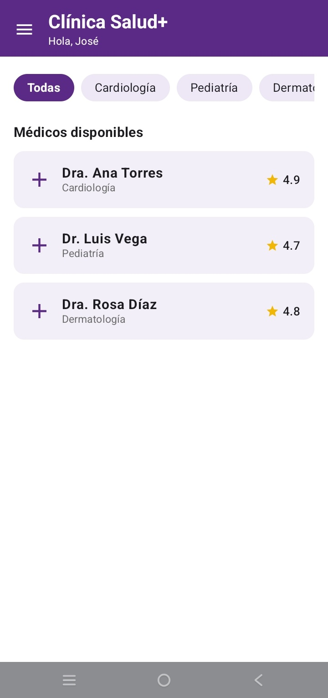
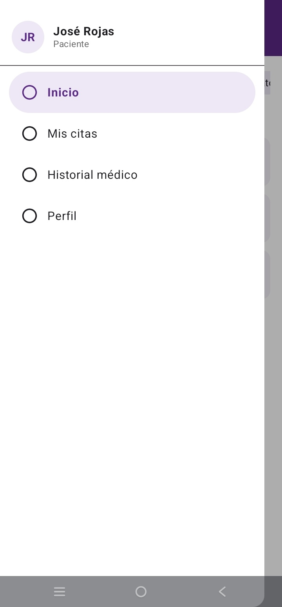
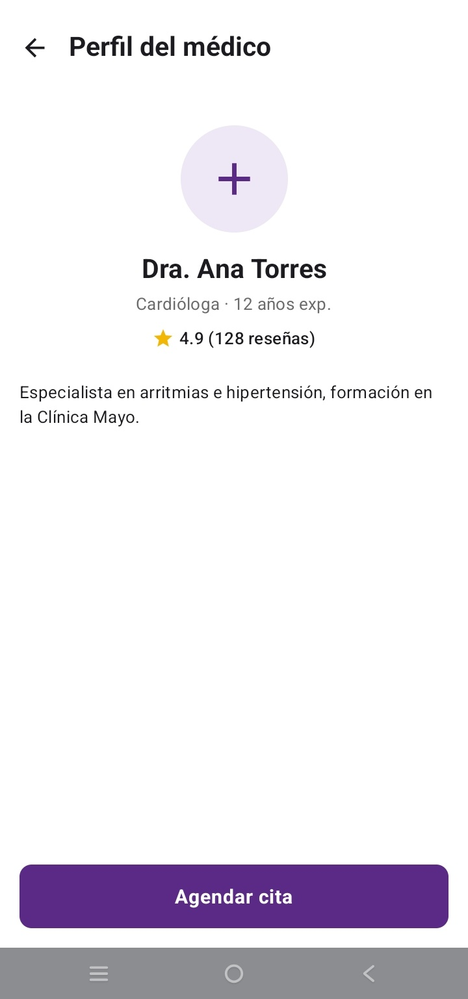
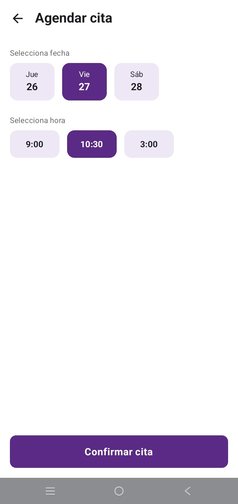
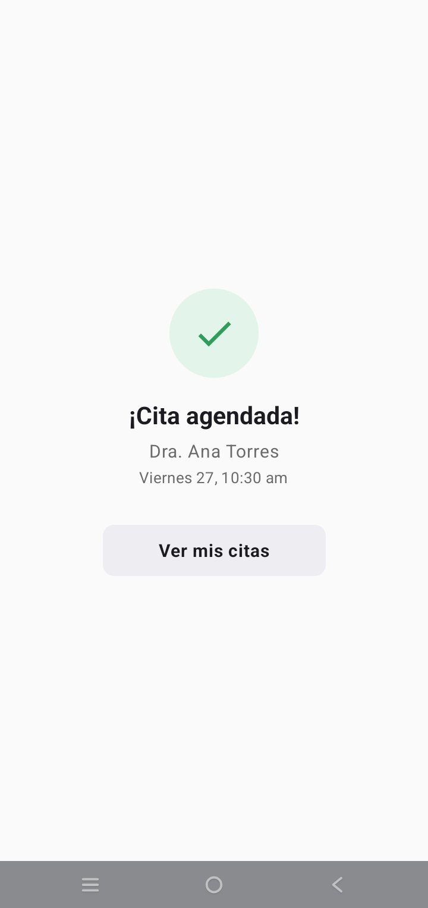
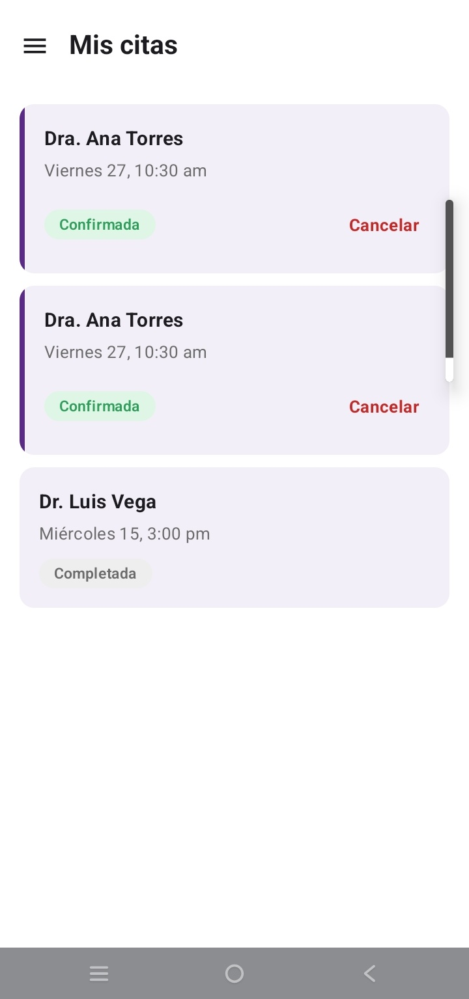
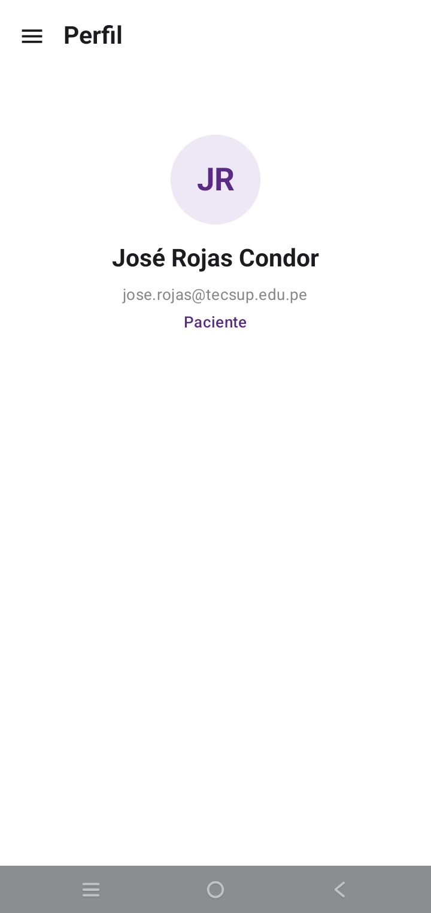

# PROMPTS.md – Fase 2: mejora con IA (rama `mejora-ia`)

**App:** Clínica Salud+ (Opción A)
**Alumno:** José Rojas Condor
**Asistente de IA:** Gemini en Android Studio (modo Agent)

**Objetivo de la mejora:** acercar la app al diseño de referencia del PDF y agregar una función nueva: **cancelar una cita con un AlertDialog de confirmación**.

Los cambios de diseño fueron estos:
- Tema morado y barra superior de Inicio con saludo.
- Tarjetas lilas en las listas.
- Chips de fecha y hora como cajas seleccionables.
- Pantalla de confirmación con ícono de check.
- Menú lateral con datos del paciente.
- Estados de las citas con etiquetas de color.

---

## Prompt 1: Tema morado, Inicio y menú lateral

```text
Trabajo en mi app Android "Clínica Salud+" (Kotlin + Jetpack Compose + Material 3, paquete com.rojas.clinica). La navegación ya funciona: AppNavigation.kt tiene un ModalNavigationDrawer que envuelve el NavHost, con las rutas "inicio", "perfil/{id}", "agendar/{id}", "confirmacion/{medico}/{fecha}/{hora}", "mis_citas" y "historial". El drawer está en componets/DrawerContent.kt.

REGLAS: no uses ViewModel ni MVVM. Todo el estado debe usar remember y mutableStateOf. Mantén las rutas, los parámetros y los callbacks que ya existen. Escribe código simple, del nivel de un curso básico de Compose.

Quiero que la app se parezca a este diseño:

1) TEMA (ui/theme): en Theme.kt pon dynamicColor = false, para que no use los colores del celular. Usa primary = Color(0xFF5B2A86) (morado oscuro), onPrimary = blanco, primaryContainer = Color(0xFFEDE7F6) (lila claro), background y surface blancos. Todos los textos principales deben ser NEGRO intenso: onBackground = Color(0xFF1C1B1F) y onSurface = Color(0xFF1C1B1F). Solo los subtítulos pequeños van en gris (0xFF6B6B6B). Los títulos de las TopAppBar de TODAS las pantallas ("Perfil del médico", "Agendar cita", "Mis citas", "Historial médico", "Perfil") van en negro y bold.

2) INICIO (screens/InicioScreen.kt):
- TopAppBar con fondo morado primary. El título es un Column con "Clínica Salud+" (blanco, bold, titleLarge) y debajo "Hola, José" (blanco, bodySmall). El ícono de menú (☰) va en blanco.
- Debajo, la LazyRow de especialidades. Chip seleccionado: fondo morado y texto blanco. Chip no seleccionado: fondo lila claro (0xFFEDE7F6) y texto oscuro. Forma redondeada (RoundedCornerShape(50)) y sin borde.
- El título "Médicos disponibles" va en negro intenso, bold, titleMedium.
- Cada médico es una Card con fondo 0xFFF3EFF8, esquinas de 12.dp y sin elevación. Dentro va un Row con:
  - a la izquierda, un ícono Icons.Default.Add morado de 28.dp;
  - en el centro, el nombre del médico en NEGRO intenso y bold, y la especialidad en gris pequeño;
  - a la derecha, un ícono de estrella (Icons.Default.Star) amarillo (0xFFF2B705) de 16.dp con la calificación al lado.
- Separación de 10.dp entre tarjetas y padding horizontal de 16.dp.

3) MENÚ LATERAL (componets/DrawerContent.kt):
- El fondo del ModalDrawerSheet debe ser BLANCO: usa drawerContainerColor = Color.White, porque por defecto sale lila.
- Encabezado: un círculo de 44.dp con fondo lila claro y las iniciales "JR" en morado bold, al lado "José Rojas" en negro intenso (0xFF1C1B1F) y bold, y debajo "Paciente" (gris 0xFF6B6B6B, bodySmall). Debajo va un HorizontalDivider.
- Opciones: Inicio, Mis citas, Historial médico y Perfil. Cada una con el ícono Icons.Outlined.RadioButtonUnchecked.
- Las opciones no seleccionadas llevan texto e ícono en negro (0xFF1C1B1F). La opción de la pantalla actual debe verse seleccionada: fondo lila claro (0xFFEDE7F6), texto morado y bold. Para eso, DrawerContent debe recibir un parámetro rutaActual: String?. En AppNavigation, obtén la ruta con navController.currentBackStackEntryAsState().
- Crea una pantalla simple screens/PerfilUsuarioScreen.kt (ruta "perfil_usuario") con TopAppBar "Perfil" y el ícono ☰ que abre el drawer. Debe mostrar el círculo "JR", el nombre "José Rojas Condor", el correo "jose.rojas@tecsup.edu.pe" y el tipo "Paciente". Regístrala en el NavHost.

Entrega el código completo de cada archivo que cambies, con su package y sus imports.
```

**Qué generó:**
- Tema morado con `dynamicColor = false`.
- Inicio con barra superior morada y saludo, chips morados y lilas, y tarjetas lilas con ícono ➕ y estrella.
- Menú lateral con encabezado "JR / José Rojas / Paciente" y la opción seleccionada resaltada.
- Nueva pantalla `PerfilUsuarioScreen` con la ruta "perfil_usuario".

**Qué tuve que corregir:**
- Los textos principales salían en gris y no en negro como en el diseño de referencia. Le pedí a Gemini que definiera `onBackground` y `onSurface` en negro (`0xFF1C1B1F`) en `Theme.kt`, y que pusiera en negro y bold el título "Médicos disponibles", los nombres de los médicos y los títulos de las TopAppBar de todas las pantallas. Así se cambiaron también los títulos de Mis citas, Historial médico, Perfil del médico y Agendar cita.

---

## Prompt 2: Perfil del médico, Agendar cita y Confirmación

```text
Sigo con mi app Clínica Salud+ (paquete com.rojas.clinica, sin ViewModel, solo remember/mutableStateOf, código simple). Ahora quiero que estas 3 pantallas se parezcan al diseño de referencia. Mantén los mismos parámetros y callbacks que ya tienen.

1) MODELO (data/Models.kt y data/LocalDataSource.kt): agrega a la data class Medico los campos aniosExperiencia: Int, resenas: Int y descripcion: String. Llénalos en LocalDataSource. Por ejemplo, Dra. Ana Torres: 12 años, 128 reseñas, "Especialista en arritmias e hipertensión, formación en la Clínica Mayo."

2) PERFIL DEL MÉDICO (screens/PerfilMedicoScreen.kt):
- TopAppBar blanca con la flecha atrás y el título "Perfil del médico".
- Contenido centrado:
  - un círculo de 88.dp con fondo lila claro (0xFFEDE7F6) y un ícono Add morado de 44.dp;
  - el nombre en NEGRO intenso y bold (titleLarge);
  - "Cardióloga · 12 años exp." en gris;
  - una fila con una estrella amarilla y "4.9 (128 reseñas)".
- Debajo, la descripción alineada a la izquierda en bodyMedium.
- Al fondo de la pantalla, un botón morado de ancho completo "Agendar cita", con altura de 52.dp y esquinas de 10.dp.

3) AGENDAR CITA (screens/AgendarCitaScreen.kt):
- TopAppBar blanca con flecha atrás y el título "Agendar cita".
- Título de la TopAppBar "Agendar cita" en negro y bold. Label "Selecciona fecha" en gris, bodySmall.
- Tres cajas de fecha en un Row:
  - cada caja de 72x60.dp con esquinas de 12.dp;
  - dentro, arriba el día corto ("Jue", "Vie", "Sáb") pequeño y abajo el número ("26", "27", "28") en bold;
  - caja seleccionada: fondo MORADO y textos blancos; no seleccionada: fondo lila claro y textos en NEGRO intenso (no gris);
  - al tocarla se selecciona.
- Label "Selecciona hora" y tres cajas de hora ("9:00", "10:30", "3:00") con el mismo estilo, de 80x44.dp.
- Es una selección única, como un RadioButton: guárdala con remember { mutableStateOf(...) }.
- IMPORTANTE: al confirmar, sigue enviando a onConfirmar los mismos textos completos que ya usa la app ("Viernes 27" y "10:30 am"), para que Confirmación y Mis citas los muestren igual.
- Al fondo, el botón morado de ancho completo "Confirmar cita", con altura de 52.dp.

4) CONFIRMACIÓN (screens/ConfirmacionScreen.kt):
- Todo centrado:
  - un círculo de 80.dp con fondo verde claro (0xFFE3F4EA) y un ícono Icons.Default.Check verde (0xFF2E9E5B) de 40.dp;
  - "¡Cita agendada!" en bold (titleLarge);
  - el nombre del médico en gris;
  - "Viernes 27, 10:30 am" en gris.
- Debajo, un Button "Ver mis citas" con Modifier.width(200.dp).height(46.dp), fondo gris claro (0xFFEEEEF2), texto NEGRO, esquinas de 10.dp y sin elevación.

Entrega el código completo de cada archivo que cambies.
```

**Qué generó:**
- Nuevos campos en `Medico`: `aniosExperiencia`, `resenas` y `descripcion`, con sus datos en `LocalDataSource`.
- Perfil del médico centrado, con círculo ➕, experiencia, reseñas, descripción y botón morado al fondo.
- Agendar cita con cajas de fecha y hora de selección única (`remember { mutableStateOf(...) }`), con la seleccionada en morado.
- Confirmación con el check verde centrado y el botón "Ver mis citas".

**Qué tuve que corregir:**
- El menú lateral salía con fondo lila por el color por defecto de `ModalDrawerSheet`. Se corrigió con `drawerContainerColor = Color.White`, y el nombre del paciente y las opciones no seleccionadas pasaron a negro intenso.
- El botón "Ver mis citas" quedaba angosto comparado con el diseño. Se le dio un ancho fijo de 200.dp y una altura de 46.dp.

---

## Prompt 3: Mis citas con estados y cancelar cita con AlertDialog

```text
Última mejora en mi app Clínica Salud+ (paquete com.rojas.clinica, sin ViewModel, solo remember/mutableStateOf, código simple). La lista de citas está en AppNavigation como val listaCitas = remember { mutableStateListOf(...) }. La data class Cita tiene var estado: String ("Confirmada" o "Completada").

1) DISEÑO DE MIS CITAS (screens/MisCitasScreen.kt):
- Mantén la TopAppBar con el ícono ☰ y el título "Mis citas" en bold.
- Cada cita es una Card con fondo 0xFFF3EFF8, esquinas de 12.dp y sin elevación.
- Si la cita está Confirmada, lleva una barra morada vertical de 4.dp a la izquierda (Box con fillMaxHeight dentro de un Row con height(IntrinsicSize.Min)).
- Dentro de la Card:
  - el nombre del médico en NEGRO intenso y bold;
  - "Viernes 27, 10:30 am" en gris;
  - una etiqueta redondeada con el estado: Confirmada con fondo 0xFFDFF5E6 y texto verde 0xFF2E9E5B; Completada con fondo 0xFFEEEEEE y texto gris; Cancelada con fondo 0xFFFDE7E9 y texto rojo 0xFFC62828.

2) NUEVA FUNCIÓN, CANCELAR CITA:
- Solo en las citas "Confirmada", agrega a la derecha de la etiqueta un TextButton rojo "Cancelar".
- Al tocarlo, muestra un AlertDialog con:
  - título "Cancelar cita";
  - el texto "¿Seguro que deseas cancelar tu cita con [médico] el [fecha] a las [hora]?";
  - los botones "Sí, cancelar" (rojo) y "No".
- Guarda la cita elegida en var citaACancelar by remember { mutableStateOf<Cita?>(null) }.
- MisCitasScreen debe recibir un nuevo parámetro onCancelar: (Cita) -> Unit. En AppNavigation, la cita debe pasar a estado "Cancelada" en listaCitas.
- Al cancelar, muestra un Snackbar con "Cita con [médico] cancelada" (SnackbarHostState en el Scaffold).

Entrega el código completo de MisCitasScreen.kt y el bloque composable("mis_citas") de AppNavigation.
```

**Qué generó:**
- Tarjetas de Mis citas con fondo lila, barra morada a la izquierda en las confirmadas y etiquetas de color para Confirmada, Completada y Cancelada.
- Un `TextButton` rojo "Cancelar" solo en las citas confirmadas.
- Un `AlertDialog` de confirmación con el médico, la fecha y la hora, controlado por `var citaACancelar by remember { mutableStateOf<Cita?>(null) }`.
- En `AppNavigation`, la cancelación reemplaza la cita en la lista con una copia: `listaCitas[index] = listaCitas[index].copy(estado = "Cancelada")`, buscando el índice con `indexOfFirst { it.id == cita.id }`.
- Un `Snackbar` "Cita con [médico] cancelada" mostrado dentro de `scope.launch { }`.

**Qué tuve que corregir / revisar:**
- Revisé que el cambio de estado no se hiciera con `cita.estado = "Cancelada"`. Así la pantalla no se actualiza, porque `mutableStateListOf` solo detecta cuando se agrega, quita o reemplaza un elemento. Gemini ya usó `copy(...)` para reemplazar la cita, así que la lista se actualiza bien.
- Revisé que `showSnackbar` se llamara dentro de `scope.launch { }`, porque es una función `suspend`.
- Probé el flujo completo: agendar una cita, verla como Confirmada en Mis citas, cancelarla desde el AlertDialog y ver que pasa a Cancelada con el aviso abajo.

---

## Resultado final

Así quedó la app después de aplicar los 3 prompts y sus correcciones.

<table>
  <tr>
    <th>Inicio (Prompt 1)</th>
    <th>Menú lateral (Prompt 1)</th>
    <th>Perfil del médico (Prompt 2)</th>
  </tr>
  <tr>
    <td></td>
    <td></td>
    <td></td>
  </tr>
  <tr>
    <th>Agendar cita (Prompt 2)</th>
    <th>Cita agendada (Prompt 2)</th>
    <th>Mis citas (Prompt 3)</th>
  </tr>
  <tr>
    <td></td>
    <td></td>
    <td></td>
  </tr>
  <tr>
    <th>Perfil del paciente (Prompt 1)</th>
    <th></th>
    <th></th>
  </tr>
  <tr>
    <td></td>
    <td></td>
    <td></td>
  </tr>
</table>
