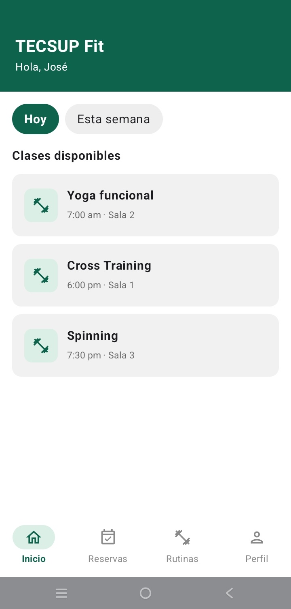
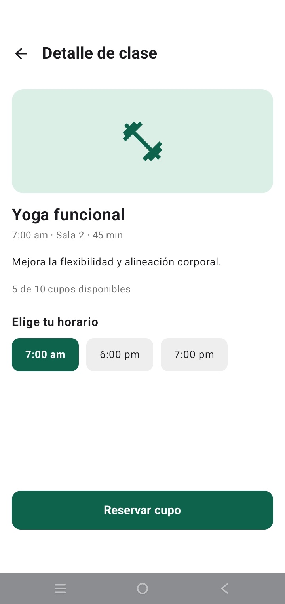
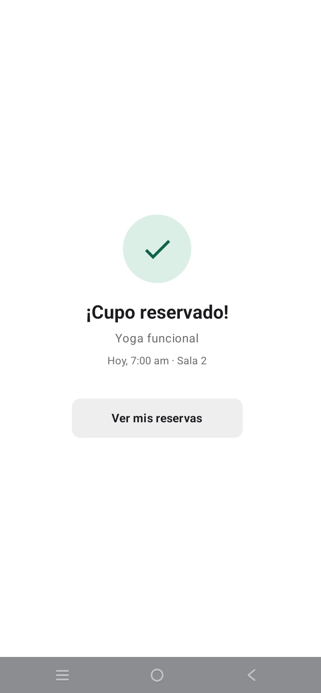
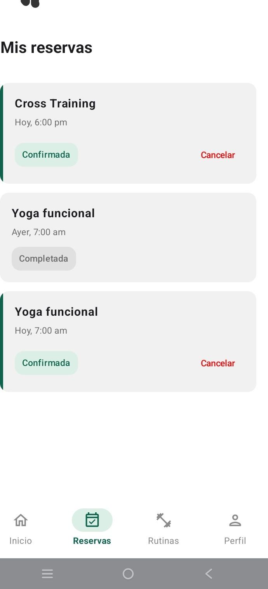
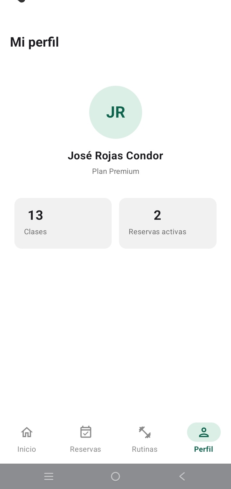

# PROMPTS.md – Fase 2: mejora con IA (rama `mejora-ia`)

**App:** TECSUP Fit (Opción B)
**Alumno:** José Rojas Condor
**Asistente de IA:** Gemini en Android Studio (modo Agent)

**Objetivo de la mejora:** acercar la app al diseño de referencia del PDF (Figuras 3 y 4) y agregar funciones nuevas:
- un bottomBar con íconos reales que solo aparece en las pestañas principales;
- filtros "Hoy / Esta semana" que sí filtran la lista;
- selección única del horario antes de reservar;
- reservas compartidas entre pantallas;
- un Snackbar con opción **Deshacer** al cancelar;
- estadísticas del perfil calculadas a partir de las reservas.

---

## Prompt 1: Tema verde, bottomBar e Inicio

```text
Trabajo en mi app Android "TECSUP Fit" (Kotlin + Jetpack Compose + Material 3, paquete com.rojas.tecsupfit). Ya tiene navegación con NavHost en navigation/AppNavigation.kt, con las rutas "inicio", "mis_citas", "historial", "perfil_usuario", "agendar_cita/{claseId}" y "confirmacion/{claseId}". Los datos están en data/LocalDataSource.kt y data/Models.kt.

REGLAS: no uses ViewModel ni MVVM. Todo el estado debe usar remember y mutableStateOf. Mantén las rutas que ya existen. Escribe código simple, del nivel de un curso básico de Compose.

1) TEMA:
- En Theme.kt pon dynamicColor = false.
- Usa primary = Color(0xFF0D634C) (verde TECSUP), onPrimary = blanco, background y surface blancos.
- Usa onBackground y onSurface = Color(0xFF1C1B1F) para que los textos principales sean negro intenso.
- La app debe verse SIEMPRE en modo claro, aunque el celular esté en modo oscuro. En TecsupFitTheme usa siempre LightColorScheme (darkTheme = false). Además, el Scaffold de AppNavigation y todas las pantallas (Mis reservas, Rutinas, Perfil, Detalle, Confirmación) deben tener fondo BLANCO: usa containerColor = Color.White en los Scaffold y Modifier.background(Color.White) en los Column principales.
- Agrega en build.gradle.kts la dependencia implementation("androidx.compose.material:material-icons-extended").

2) BOTTOMBAR (AppNavigation.kt):
- Cada NavigationBarItem debe tener un ícono real:
  - Inicio → Icons.Outlined.Home
  - Reservas → Icons.Outlined.EventAvailable
  - Rutinas → Icons.Outlined.FitnessCenter
  - Perfil → Icons.Outlined.Person
- La pestaña activa se resalta: ícono y texto en verde 0xFF0D634C y bold. Las inactivas van en gris 0xFF8A8A8A. Usa NavigationBarItemDefaults.colors con indicatorColor = Color(0xFFDCEFE6).
- El bottomBar solo debe verse en "inicio", "mis_citas", "historial" y "perfil_usuario". En el detalle y en la confirmación debe ocultarse: usa un if con la ruta actual (currentBackStackEntryAsState).
- Al tocar una pestaña, navega con launchSingleTop = true y popUpTo("inicio"), para que no se apilen pantallas repetidas.

3) MODELO: agrega a ClaseFit el campo dia: String con los valores "Hoy" o "Semana". En LocalDataSource agrega dos clases más con dia = "Semana" (por ejemplo "Pilates" 9:00 am Sala 2 y "Box funcional" 5:00 pm Sala 1). Las 3 clases actuales quedan con dia = "Hoy".

4) INICIO (screens/InicioScreen.kt):
- Encabezado verde (0xFF0D634C) de ancho completo, con "TECSUP Fit" (blanco, bold, 22.sp) y debajo "Hola, José" (blanco, 14.sp). Respeta la barra de estado con statusBarsPadding().
- Cambia el Row de chips por una LazyRow con "Hoy" y "Esta semana":
  - chip seleccionado: fondo verde y texto blanco;
  - no seleccionado: fondo gris claro 0xFFEEEEEE y texto negro;
  - forma RoundedCornerShape(50) y sin borde.
- El filtro debe filtrar la LazyColumn: "Hoy" muestra las clases con dia == "Hoy" y "Esta semana" muestra todas.
- El título "Clases disponibles" va en negro intenso, bold y 16.sp.
- Cada tarjeta: Card con fondo 0xFFF1F1F1, esquinas de 12.dp y sin elevación. Dentro va un Row con:
  - una caja de 44.dp con fondo verde menta 0xFFDCEFE6, esquinas de 10.dp y el ícono Icons.Filled.FitnessCenter verde de 24.dp;
  - el nombre en negro y bold;
  - debajo, "7:00 am · Sala 2" en gris.

5) TEXTOS EN NEGRO: todos los textos principales deben llevar explícitamente color = Color(0xFF1C1B1F) y FontWeight.Bold, para que no dependan del tema:
- el título "Clases disponibles";
- los nombres de las clases en Inicio, Mis clases y Rutinas;
- el nombre del usuario en Perfil;
- los títulos de cada pantalla.
Solo los horarios, salas y textos secundarios van en gris (0xFF6B6B6B).

Entrega el código completo de cada archivo que cambies, con su package y sus imports.
```

**Qué generó:**
- Tema verde con `dynamicColor = false` y la librería de íconos extendida.
- bottomBar con íconos (Home, EventAvailable, FitnessCenter, Person), la pestaña activa resaltada en verde y oculta en Detalle y Confirmación.
- Inicio con encabezado verde, chips "Hoy" / "Esta semana" en una LazyRow que filtran la lista, y tarjetas con ícono de pesa.

**Qué tuve que corregir:**
- Solo Inicio se veía con fondo blanco. Las demás pantallas (Reservas, Rutinas, Perfil) salían con fondo oscuro, porque el tema usaba el esquema oscuro cuando el celular estaba en modo oscuro, y esas pantallas no tenían un fondo propio. Le pedí a Gemini que la app use siempre el esquema claro y que todas las pantallas y Scaffold tengan fondo blanco.
- Los nombres de las clases ("Yoga funcional", "Cross Training", "Spinning") y los títulos no se veían en negro intenso. Le pedí que todos los títulos y nombres usen explícitamente `color = Color(0xFF1C1B1F)` con bold, y que solo los horarios y textos secundarios vayan en gris (`0xFF6B6B6B`).

---

## Prompt 2: Detalle de clase con horario, Confirmación y reservas compartidas

```text
Sigo con mi app TECSUP Fit (paquete com.rojas.tecsupfit, sin ViewModel, solo remember/mutableStateOf, código simple).

1) RESERVAS COMPARTIDAS:
- Hoy la lista de reservas se crea dentro de MisClasesScreen con remember. Por eso se pierde al cambiar de pantalla y las reservas nuevas no aparecen.
- Mueve la lista a AppNavigation: val listaReservas = remember { mutableStateListOf<ReservaFit>().apply { addAll(LocalDataSource.misReservasIniciales) } }.
- Pásala como parámetro a MisClasesScreen (reservas: List<ReservaFit>) junto con un callback onCancelar: (ReservaFit) -> Unit.
- Al cancelar, reemplaza la reserva en la lista con copy(estado = "Cancelada"). No cambies reserva.estado directamente.

2) DETALLE DE CLASE (screens/AgendarClasesScreen.kt):
- Usa un Scaffold con TopAppBar blanca, flecha atrás (popBackStack) y el título "Detalle de clase" en negro y bold.
- Debajo, una caja de ancho completo y 140.dp de alto con fondo verde menta 0xFFDCEFE6, esquinas de 16.dp y el ícono Icons.Filled.FitnessCenter verde de 64.dp centrado.
- Luego:
  - el nombre de la clase en negro, bold y 22.sp;
  - "6:00 pm · Sala 1 · 45 min" en gris;
  - la descripción en negro, bodyMedium;
  - "8 de 12 cupos disponibles" en gris.
- NUEVO, selección única de horario: agrega el texto "Elige tu horario" y tres cajas seleccionables con el horario de la clase y dos horarios más (por ejemplo "6:00 pm", "7:00 pm", "8:00 pm").
  - Seleccionada: fondo verde y texto blanco. No seleccionada: fondo 0xFFEEEEEE y texto negro.
  - Cada caja mide 90x44.dp y tiene esquinas de 10.dp.
  - Guárdala con var horarioSeleccionado by remember { mutableStateOf(clase.horario) }.
- Al fondo, el botón verde de ancho completo "Reservar cupo", con altura de 52.dp y esquinas de 12.dp.
- Al tocarlo:
  - agrega a listaReservas una ReservaFit nueva con tituloClase = clase.titulo, horario = "Hoy, " + horarioSeleccionado y estado = "Confirmada";
  - luego navega a "confirmacion/{claseId}/{horario}" pasando el horario elegido. Actualiza la ruta en el NavHost con un segundo navArgument de tipo String.

3) CONFIRMACIÓN (screens/ConfirmacionScreen.kt):
- Usa un Scaffold con containerColor = Color.White y aplica su padding, SIN TopAppBar (igual que el diseño de referencia).
- Todo centrado:
  - un círculo de 80.dp con fondo 0xFFDCEFE6 y el ícono Icons.Filled.Check verde de 40.dp;
  - "¡Cupo reservado!" en negro, bold y titleLarge;
  - el nombre de la clase en gris;
  - "Hoy, [horario elegido] · [sala]" en gris.
- Debajo, un Button "Ver mis reservas" con Modifier.width(200.dp).height(46.dp), fondo 0xFFEEEEEE, texto negro, esquinas de 10.dp y sin elevación. Navega a "mis_citas" con popUpTo("inicio").

Entrega el código completo de cada archivo que cambies.
```

**Qué generó:**
- La lista de reservas se movió a `AppNavigation` como `mutableStateListOf`, compartida entre pantallas.
- Detalle de clase con Scaffold, caja verde menta con ícono de pesa y selección única de horario con `remember { mutableStateOf(...) }`.
- "Reservar cupo" agrega la reserva a la lista y navega a la confirmación pasando el horario elegido.
- Confirmación con el check verde centrado y el botón "Ver mis reservas".

**Qué tuve que corregir:**
- La confirmación salía con una barra superior "Confirmación" y un botón extra "Volver al inicio" que no aparecen en el diseño de referencia de TECSUP Fit. Le pedí a Gemini quitar la TopAppBar (manteniendo el Scaffold con fondo blanco y su padding) y dejar solo el botón "Ver mis reservas".

---

## Prompt 3: Mis reservas, Rutinas y Perfil con estadísticas, y deshacer cancelación

```text
Última mejora en mi app TECSUP Fit (paquete com.rojas.tecsupfit, sin ViewModel, solo remember/mutableStateOf, código simple). La lista de reservas ya está en AppNavigation como listaReservas (mutableStateListOf) y se pasa a MisClasesScreen.

1) MIS RESERVAS (screens/MisClasesScreen.kt):
- Usa un Scaffold con TopAppBar blanca y el título "Mis reservas" en negro y bold.
- Cada reserva es una Card con fondo 0xFFF1F1F1, esquinas de 12.dp y sin elevación.
- Si está Confirmada, lleva una barra verde vertical de 4.dp a la izquierda.
- Dentro de la Card:
  - el nombre de la clase en negro y bold;
  - el horario en gris;
  - una etiqueta redondeada con el estado: Confirmada con fondo 0xFFDCEFE6 y texto verde 0xFF0D634C; Completada con fondo 0xFFE0E0E0 y texto gris; Cancelada con fondo 0xFFFDE7E9 y texto rojo 0xFFC62828.
- Mantén el botón "Cancelar" y el AlertDialog que ya existen.
- NUEVO: al confirmar la cancelación, muestra un Snackbar "Reserva de [clase] cancelada" con actionLabel = "Deshacer".
  - Si el usuario toca Deshacer, la reserva vuelve a estado "Confirmada" (reemplazándola con copy en la lista).
  - Usa SnackbarHostState en el Scaffold y llama a showSnackbar dentro de scope.launch.
  - Revisa si el resultado es SnackbarResult.ActionPerformed.

2) RUTINAS (screens/RutinasScreen.kt): Scaffold con TopAppBar "Rutinas" en negro y bold. Las tarjetas usan el mismo estilo que Mis reservas, con un ícono FitnessCenter verde a la izquierda.

3) MI PERFIL (screens/PerfilUsuarioScreen.kt):
- Usa un Scaffold con TopAppBar blanca y el título "Mi perfil" en negro y bold.
- Debe recibir la lista de reservas como parámetro (reservas: List<ReservaFit>).
- Contenido centrado:
  - un círculo de 88.dp con fondo 0xFFDCEFE6 y las iniciales "JR" en verde, bold y 26.sp;
  - "José Rojas Condor" en negro y bold;
  - "Plan Premium" en gris.
- Dos tarjetas de estadísticas lado a lado (weight(1f), fondo 0xFFF1F1F1, esquinas de 12.dp), con el número grande en negro y bold, y la etiqueta en gris:
  - "Clases": cantidad de reservas con estado "Completada" más 12 (historial previo);
  - "Reservas activas": cantidad de reservas con estado "Confirmada".
- NUEVO: estas estadísticas deben calcularse a partir de la lista de reservas, para que cambien al reservar o cancelar.

Entrega el código completo de MisClasesScreen.kt, RutinasScreen.kt, PerfilUsuarioScreen.kt y los cambios en AppNavigation.
```

**Qué generó:**
- Mis reservas con Scaffold y barra "Mis reservas", tarjetas grises con barra verde en las confirmadas y etiquetas de color para Confirmada, Completada y Cancelada.
- Al cancelar desde el AlertDialog, un Snackbar "Reserva de [clase] cancelada" con la acción **Deshacer**, que devuelve la reserva a Confirmada usando `copy(...)`. `showSnackbar` se llama dentro de `scope.launch { }`.
- Rutinas con el mismo estilo de tarjetas e ícono de pesa.
- Mi perfil con las iniciales "JR", el nombre, "Plan Premium" y dos tarjetas de estadísticas calculadas a partir de la lista de reservas, que cambian al reservar o cancelar.

**Qué tuve que corregir:**
- Nada. Revisé que el estado se cambiara con `copy(...)` y no con `reserva.estado = ...`, y que el Snackbar se llamara dentro de `scope.launch`. Las dos cosas ya venían bien. Probé reservar, cancelar, deshacer y ver cómo cambian las estadísticas del perfil.

---

## Resultado final

Así quedó TECSUP Fit después de aplicar los 3 prompts y sus correcciones.

<table>
  <tr>
    <th>Inicio (Prompt 1)</th>
    <th>Detalle de clase (Prompt 2)</th>
    <th>Cupo reservado (Prompt 2)</th>
  </tr>
  <tr>
    <td></td>
    <td></td>
    <td></td>
  </tr>
  <tr>
    <th>Mis reservas (Prompt 3)</th>
    <th>Mi perfil (Prompt 3)</th>
    <th></th>
  </tr>
  <tr>
    <td></td>
    <td></td>
    <td></td>
  </tr>
</table>
